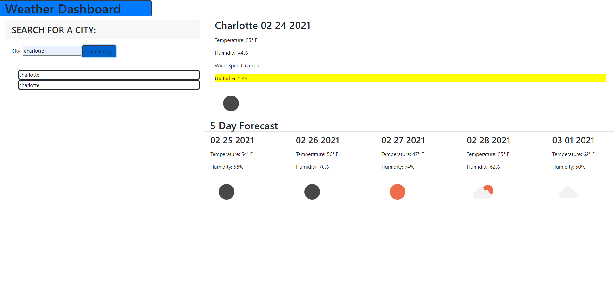

# ch6-weatherdashboard

## Table of Contents

<br>

[Description](#description)

[Usage](#Usage)

[Criteria](#criteria)

<br>

## Description

<br>

This project allows the user to search different cities and have the forecast for the next 5 days displayed. They will see information such as the temperature, wind speed, humidity, uv index (which changes color), and an icon will appear to show what the weather is like. The searches are saved to local storage and appear in a history list below the search bar. Unfortunately, I was unable to make the history list items clickable to re-search the city.


<br>
<br>


## Usage
<br>
To access the website, go to https://ngkent75.github.io/ch6-weatherdashboard/

<br>
Click on the search bar to type in the city you want the forecast for, and click the button. Your history will be saved and listed below.
<br>




<br>

## Criteria

<br>

```
GIVEN a weather dashboard with form inputs
WHEN I search for a city
THEN I am presented with current and future conditions for that city and that city is added to the search history
WHEN I view current weather conditions for that city
THEN I am presented with the city name, the date, an icon representation of weather conditions, the temperature, the humidity, the wind speed, and the UV index
WHEN I view the UV index
THEN I am presented with a color that indicates whether the conditions are favorable, moderate, or severe
WHEN I view future weather conditions for that city
THEN I am presented with a 5-day forecast that displays the date, an icon representation of weather conditions, the temperature, and the humidity
WHEN I click on a city in the search history
THEN I am again presented with current and future conditions for that city
```